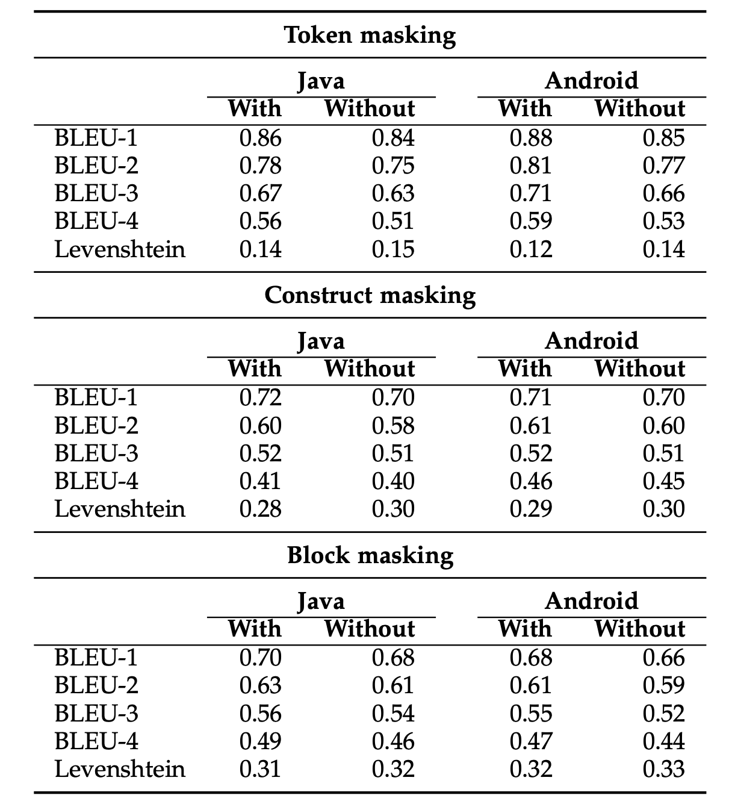
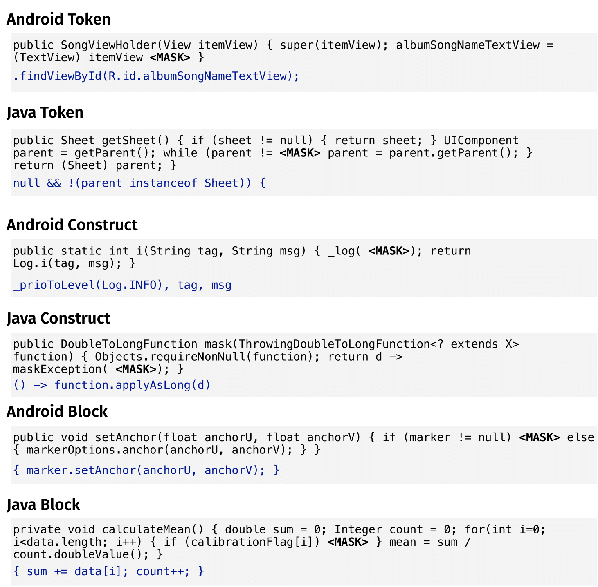
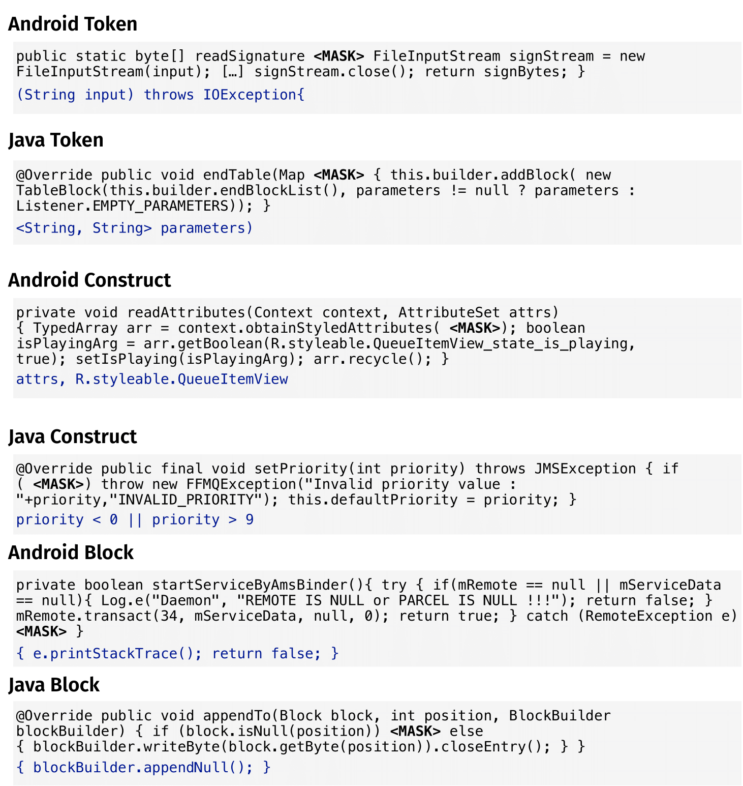
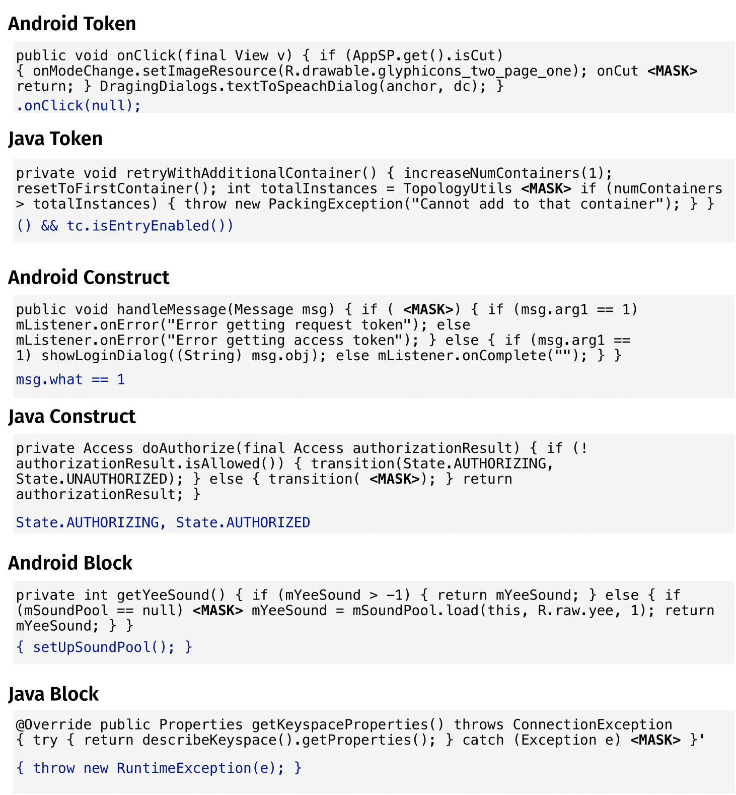

# An empirical study on the usage of T5 models for Code Completion

This study extends our previous work: "[An Empirical Study on the Usage of BERT Models for Code Completion](https://arxiv.org/pdf/2103.07115.pdf)".

In this work we explored the capabilities of **Text-To-Text Transfer Transformer (T5)** for Code Completion related tasks. For the task we're going to mask some tokens and then check if the model is able to predict them.

### Preliminary step
The training of the model is done on a TPU instance of **Colab**.
A GCS Bucket is mandatory.
To Set up a new GCS Bucket for training and fine-tuning a T5 Model, please follow the original guide provided by Google [here](https://cloud.google.com/storage/docs/quickstart-console).


### Pipeline
* ##### Dataset

    You can find the datasets used for pretraining and fine-tuning the models [here](https://drive.google.com/drive/folders/17LlqNQeZ6BkRACJY34munsHtymOqLunV?usp=sharing) and [here](https://drive.google.com/drive/folders/1_tSaJzoG3v9ypwmI3HzR2GTbWgWgZJ-L?usp=sharing). 
    For pretraining tokenizer we shared also **key.csv** file with information about each method.
* ##### Tokenizer

    We trained the tokenizer using the script in `Tokenizer` folder.
    ```
    python3 tokenizer.py --input=<input_file> --model_prefix=code --vocab_size=32000 --bos_id=-1  --eos_id=1 --unk_id=2 --pad_id=0
    ```
    Where:
    - input: the path for the txt file containing the code to tokenize 
    - model_prefix: the prefix for the tokenizer (e.g. code => it generates code.vocab and code.model)
    - vocab_size: the size of the vocabulary
    - bos_id: begin of sentence id (this change only the order or the tokens stored in the vocabulary- bos_id: begin of sentence id (this change only the order or the tokens stored in the vocabulary)
    - eos_id: end of sentence id (this change only the order or the tokens stored in the vocabulary)
    - unk_id: unknown token id (this change only the order or the tokens stored in the vocabulary)
    - pad_id: padding id (this change only the order or the tokens stored in the vocabulary)
    You can find the tokenizer in `Pretraining/tokenizer_model` folder.
    
* ##### Pretraining
    
    For the pretraining model you can find the notebook **pretrain.ipynb** in `Pretraining` folder. 
    The notebook has some comments that explain how to run it.
    You can also find the gin file for config in `configuration_file` folder and the trained tokenizer in `tokenizer_model` folder.
    The pretrained model is available [here](https://drive.google.com/drive/folders/1783WqX5GypthAG9FS2uYlSDR9d0zslEB?usp=sharing)
* ##### Hyper Parameter tuning

    We did hyper parameter tuning to find the best model for the finetuning.
    We tested 4 configuration and trained the model for 100k steps.
    The configuration are the following:
    - constant learning rate (lr = 0.001)
    - Inverse Square Root (warmup_steps = 10000)
    - slanted (cut_fraction=0.1, ratio=32, max_learning_rate=0.01, start_step=0)
    - polynomial learning rate (starter_learning_rate=0.01, end_learning_rate=1e-6, decay_step=10000, power=0.5)
    
    You can find the commented notebooks in `HP_Tuning/pretraining_script`.
    The configuration files for each HP tuning are in `HP_Tuning/configuration_files`.
    You can find the script to evaluate the performances in `HP_Tuning/evaluation` folder.
    ```
    python3 perfect_predictions.py --folder <folder_with_prediction> 
    ```
    In the **--folder** you have to save all the files generated during the evaluation by tensorflow.
    You can find [here](https://drive.google.com/drive/folders/1HoqMM1adk7AiLknvc42ErjGcpgQn9jiM?usp=sharing) the HP tuning models and the files for the predictions
    
    Then we evaluated the performance; the best model was **slanted**.
    Here the **percentage of perfect predictions** for each model:
    | DATASET           | CONSTANT | SLANTED | ISR   | POLYNOMIAL |
    |-------------------|----------|---------|-------|------------|
    | java construct    |    50.51 |   52.11 | 50.77 |      31.36 |
    | java block        |    24.85 |   26.92 | 25.52 |       7.46 |
    | java token        |    65.42 |   66.45 | 65.43 |      44.75 |
    | android construct |    48.20 |   49.98 | 48.59 |      27.98 |
    | android block     |    25.97 |   27.96 | 26.46 |       7.99 |
    | android token     |    68.23 |   69.37 | 68.38 |      46.70 |
    | overall           |    57.62 |   58.97 | 57.81 |      37.28 |
    
* ##### Finetuning

    For the finetuning phase, we wanted to evaluate if the pretrained model is able to increase the performance of the model and if the training on multiple tasks can give reciprocal benefits to all the tasks.
    To **evaluate the performance** of each model we used a beam size of 1 (in order to be comparable with RoBERTa model).
    We did 3 different fine tuning:
    - A multi-task finetuning (in `Finetuning/multitask` folder)
    - A single-task finetuning for each dataset (6 models) starting from pretrained model (in `Finetuning/single_task_from_pretrained` folder)
    - A single-task finetuning for each dataset (6 models) starting from scratch (in `Finetuning/single_task_no_pretrained` folder)
    
    We finetuned the **multi-task** model for 400k steps (around 29 epochs).
    We chosed the number of steps of the other models so that the number of training epochs is 29.
    The following table contains the number of training steps for each model:
    | DATASET           | STEPS |
    |-------------------|------:|
    | java construct    | 85000 |
    | java block        | 34000 |
    | java token        | 85000 |
    | android construct | 85000 |
    | android block     | 24000 |
    | android token     | 85000 |
    
    You can finetune and evaluation running **Fine_tuning.ipynb** and **evaluate.ipynb** notebooks (read the comments in the notebook).
    For the evaluation you have to load on the Bucket the input file containing the methods you want to predict and use the path of this file for the **input_file** in the predict method.
    For the multi-task finetuning you have to merge all the input files for each task in order to predict all methods in one single step
    
    **Multi-task finetuning**
    
    You can evaluate the **number of perfect predictions** running:
    ```
    python3 perfect_predictions.py --input_path <path_to_input_file>  --target_path <path_to_target_file> --prediction_path <path_to_prediction_file>
    ```
    Where
    - input_path contains the file you want to predict
    - target_path contains the file with the correct value that the model should predict
    - prediction_path contains the file with the T5 predictions
        
    **Single-task finetuning from pretrained model**
    
    You can evaluate the **number of perfect predictions** running:
    ```
    python3 perfect_predictions.py --target_path <path_to_target_file> --prediction_path <path_to_prediction_file>
    ```
    Where
    - target_path contains the file with the correct value that the model should predict
    - prediction_path contains the file with the T5 predictions
    
    **Single-task finetuning from scratch**
    
    You can evaluate the **number of perfect predictions** running:
    ```
    python3 perfect_predictions.py --target_path <path_to_target_file> --prediction_path <path_to_prediction_file>
    ```
    Where
    - target_path contains the file with the correct value that the model should predict
    - prediction_path contains the file with the T5 predictions
        
    A recap table with the percentage of perfect prediction is below:
    | DATASET           | MULTI-TASK PRETRAINED | SINGLE-TASK PRETRAINED | SINGLE-TASK FROM SCRATCH |
    |-------------------|-----------------------|------------------------|--------------------------|
    | java construct    |                 52.29 |                  51.20 |                    48.41 |
    | java block        |                 28.84 |                  27.18 |                    22.90 |
    | java token        |                 66.31 |                  62.86 |                    60.92 |
    | android construct |                 50.78 |                  49.30 |                    46.75 |
    | android block     |                 29.74 |                  27.48 |                    22.76 |
    | android token     |                 69.26 |                  64.83 |                    63.77 |
    | overall           |                 59.29 |                  56.24 |                    54.10 |
    
    You can see that training a model with multiple tasks is beneficial for all the tasks.
    The pretraining is useful to increase the performances of each model.
    
    You can find the models and the predictions [here](https://drive.google.com/drive/folders/1tRsKzKvcmJRaczOUzYHmhIlR8WZR38qY?usp=sharing)
    
### Score Analysis
We chose the **best model** found (i.e., multi-task model with pre-training) to further analyze its performance. 
T5 returns a **score** for each prediction, ranging from minus infinity to 0. This score is the log likelihood of the prediction itself. It means that if the score is 0 then the log likelihood (ln) of the prediction is 0. So the likelihood is 1 and this implies that the model has confidence 100\% that the prediction is correct (high confidence). If the score is -2 then the log likelihood of the prediction is -2. So the likelihood is 0.14 and this implies that the model has confidence 14\% that the prediction is correct (low confidence).

To compute the score file you can run the notebook **evaluate_score.ipynb** in `Score` folder.

To see the percentage of perfect prediction for each class and the analysis of Levenshtein distance among all classes you can run:
```
python3 score_analysis.py --input_path <folder_with_input_files> --score_path <path_to_score_file> --score
```
where
- input_path is the folder that contains inputs.txt, targets.txt, predictions.txt files (respectively the input given to T5 model, the target you want T5 to predict and the prediction file)
- score_path is the path to the file with the scores

To evaluate the average length of the predictions for each class you can run:

```
python3 score_analysis.py  --input_path <folder_with_input_files> --score_path <path_to_score_file> --length
```
where
- input_path is the file that contains the files cited above (and a new file lengths.txt with the number of tokens of each prediction)
- score_path is the path to the file with the scores

We also computed the number of perfect prediction related to the number of tokens to predict. You can run:

```
python3 score_analysis.py --input_path <folder_with_input_files>  --score_path <path_to_score_file> --perfect
```
where
- input_path is the file that contains the files cited above 
- score_path is the path to the file with the scores

To assess the metrics like BLEU score and Levenshtein distance you can run:
```
python3 score_analysis.py --input_path <folder_with_input_files>  --score_path <path_to_score_file> --metrics
```
You can find all the results (and the scores.txt files) in the folder `Scores/Results`

### Analysis of semantic equivalent predictions

We analyzed 200 prediction that are not perfect predictions to check whether the predictions, although not perfect, have the same behaviour of the target.
We decided to analyze the performance with highest confidence given from T5 model.
You can find the script and the results in `Semantical_Equivalence` folder:

```
python3 prediction_analysis.py --input_path <path_to_input_folder> --score_path <path_to_score_file> --output_path <path_to_output_folder> --check_best
```
where
- input_path is the folder that contains inputs.txt, targets.txt, predictions.txt files, lengths.txt (as seen before)
- score_path is the path to the file with the scores
- output_folder is the folder you want to save results in

### Models comparison

You can find [here](https://drive.google.com/file/d/1oZoo58NRB4LQJVH8P-AxEU0yi7jAVyq2/view?usp=sharing) two csv files that compare T5, RoBERTa and n-gram models.
Some analysis were done by using Excel filters.

If you want to compare the RoBERTa and n-gram model with T5 without pretraining you can run:
```
python3 prediction_analysis.py --result_csv <path_to_csv_file> --output_folder  <path_to_output_folder>
```
where:
- result_csv is the path to the csv file (without pretraining) that you can find in the link above
- output_folder is the path where you want to save the result
You can find the script and the results in `No_Pretraining_Comparison` folder

### Comparison with n-gram with cloning
We replicate the study of [MSR paper](https://arxiv.org/abs/2103.07115) using n-gram model with the cloning of a bunch of repositories with 200 methods.
You can run:
```
python3 prediction_analysis.py --input_folder <input_for_n_gram> --output_folder  <path_to_output_folder> --result_csv <path_to_csv_file>
```
where:
- input_folder is the path containing the output of n-gram model trained in MSR paper (useful to retrieve the id of the trained methods)
- output folder is the path where you want to save results
- result_csv is the path with the results of t5 model

You can find all files and results in `Cloning_Comparison` folder

### Pretraining comparison
We compared T5 multi-task with pretraining and T5 single-task without pretraining, analyzing BLEU score and Levenshtein distance.
To compute the metrics for T5 without pretraining, you can use the same code used before (you only need to change prediction file merging the predictions of each dataset in the correct order they compare in the input file).
Here the result for T5 multi-task with pretraining (With column) and single-task without pretraining (Without column):


You can find further details about RoBERTa model [here](https://github.com/RoBERTaCode/roberta)

### Qualitative analysis

We reported some examples of each model predictions.

#### T5


#### RoBERTa


#### n-gram


All these files can be found in `Perfect_Prediction_Examples` folder

## How to cite

For the original study based on the BERT model, use the following BibTeX
```
@article{ciniselli2021empirical,
  title={An Empirical Study on the Usage of BERT Models for Code Completion},
  author={Ciniselli, Matteo and Cooper, Nathan and Pascarella, Luca and Poshyvanyk, Denys and Di Penta, Massimiliano and Bavota, Gabriele},
  journal={arXiv preprint arXiv:2103.07115},
  year={2021}
}
```

For this extension based on the T5 model, use the following BibTeX
```
TODO. Add a bibtex here when available. 
```

## Contributors
[Matteo Ciniselli](https://www.inf.usi.ch/phd/cinism/),
[Nathan Cooper](https://nathancooper.io/#/about),
[Luca Pascarella](https://lucapascarella.com/),
[Antonio Mastropaolo](https://antoniomastropaolo.com/),
[Emad Aghajani](https://emadpres.github.io/),
[Denys Poshyvanyk](http://www.cs.wm.edu/~denys/),
[Massimiliano Di Penta](https://mdipenta.github.io/),
[Gabriele Bavota](https://www.inf.usi.ch/faculty/bavota/),


## License
This software is licensed under the Apache 2.0 License.

This project has received funding from the European Research Council (ERC) under the European Union's Horizon 2020 research and innovation programme (grant agreement No. 851720). W&M team was supported in part by the NSF CCF-1955853, CCF-2007246 and CCF-1815186 grants. Any opinions, findings, and conclusions expressed herein are the authors’ and do not necessarily reflect those of the sponsors.


   
    
